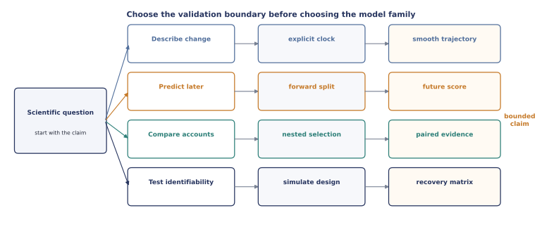

# Choose a workflow

Begin with the scientific boundary, not the model class.

For a complete analysis, encode that boundary in a frozen
[`StudyProtocol`](../protocols/index.md). The lower-level examples below remain useful for
interactive exploration, while a protocol adds source and cohort identity, fixed
candidates, recovery gates, bounded claims, and a portable evidence record.

<figure class="doc-figure">
  
  <figcaption><strong>Workflow map.</strong> The intended generalization target determines the split and evidence object before it determines the model family. This is a conceptual contract diagram.</figcaption>
</figure>

## I have a trial table

Map the four identity and chronology columns—`subject`, `session`, `trial`, and
`session_order`—into a [`Study`](../data-contract.md). Source order and additional columns
are retained. Unspool will not infer chronology from filenames or row order.

```python
from unspool import Study

study = Study.from_dataframe(
    trials,
    subject="mouse",
    session="session_id",
    trial="trial_index",
    session_order="training_day",
)
```

Next, declare what the task observations mean independently of any model:

```python
from unspool import ChoiceSpec, TaskSpec

task = TaskSpec(
    choice=ChoiceSpec(options=(0, 1)),
    predictors=("stimulus",),
)
task.validate(study)
```

The task contract is where choices, omissions, trial-specific action availability,
rewards, response times, blocks, and episodes become explicit. See the
[behavioural task contract](../task-contract.md).

For regression-style models, build a fixed labelled matrix from reusable terms:

```python
from unspool import DesignSpec, HistoryTerm, NumericTerm

design = DesignSpec(
    terms=(
        NumericTerm("stimulus", center=0.0, scale=100.0),
        HistoryTerm("choice", lags=(1, 2), coding="effect"),
    )
)
matrix = design.build(study)
```

Read [fixed design matrices](../design-matrices.md) for reset semantics and the boundary
between fixed declarations and preprocessing that must be learned inside each fold.

## I want to forecast later sessions

Use expanding or cohort-level forward-session splits. Learned clocks, scalers, landmarks,
and model choices must be fitted again inside each training fold.

```python
from unspool import cohort_forward_session_splits, evaluate_splits

splits = cohort_forward_session_splits(study, min_train_sessions=5, horizon=1)
report = evaluate_splits(model, study, splits)
```

Read [prospective validation](../validation.md) before interpreting the score.

## I want to compare explanations

Use [`compare_models`](../comparison.md) for a predeclared candidate set. Use
`nested_select_model` when candidates or hyperparameters are selected from data before the
final forecast.

## I have IBL or NWB data

Optional adapters preserve source identity and provenance without making ONE, PyNWB, or
DANDI core dependencies. See [data and interoperability](../interoperability.md).

## I need a different optimizer

The common [inference backend contract](../inference-backends.md) keeps parameter and task
semantics fixed while changing search strategy. SciPy L-BFGS-B is available in core;
install `unspool[optimization]` for the optional PyBADS multistart backend.

## I have posterior draws from a probabilistic backend

The [labelled posterior-result contract](../posterior-results.md) retains natural-scale
draws, predictions, pointwise likelihood, sampler diagnostics, observed data, and scientific
provenance without making ArviZ a core dependency. Install `unspool[probabilistic]` only for
ArviZ/xarray export or import.

## I want a complete example

The [worked studies](../tutorials/index.md) begin with published scientific questions and
carry them through cohort definition, modelling, validation, figures, and bounded
interpretation.

The [Cell 2025](../tutorials/cell2025-learning-trajectories.md) and
[IBL nested-selection](../tutorials/ibl2021-prospective-selection.md) studies are also
expressed as complete protocol migrations with exact numerical parity tests.
