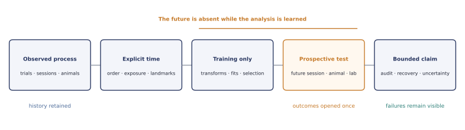

# Unspool

**Prospective modelling and falsification of behavioural trajectories across learning.**

> “One could picture it as a gradual unrolling, an unspooling of our duration.”
>
> — Henri Bergson, *An Introduction to Metaphysics*

Unspool is a Python library for scientists who need to model behaviour as a process rather
than a stationary endpoint. It preserves trials, sessions, animals, clocks, training
boundaries, candidate models, numerical warnings, and recovery evidence through the full
analysis.

!!! warning "Development status"

    Unspool is a pre-release research tool. The documentation distinguishes **supported**,
    **experimental**, **planned**, and **out-of-scope** capabilities. A model being
    importable is not by itself evidence that a particular study can identify it.

## Find your question

| I want to… | Start with |
| --- | --- |
| Represent trials without losing session or animal identity | [Longitudinal study contract](data-contract.md) |
| Choose the time coordinate for learning | [Clocks and transforms](clocks-and-transforms.md) |
| Test a model on genuinely later behaviour | [Prospective validation](validation.md) |
| Compare models without test-set selection | [Training-only comparison](comparison.md) |
| Reproduce and prospectively test a published longitudinal result | [Cell 2025 flagship study](tutorials/cell2025-learning-trajectories.md) |
| See whether drift predicts future IBL behaviour | [IBL prospective study](tutorials/ibl2021-prospective-selection.md) |
| Determine whether my design can distinguish models | [Recovery design](tutorials/model-recovery-design.md) |
| See what the library cannot yet do | [Capability matrix](methods/capability-matrix.md) |

## The evidence path

<figure class="doc-figure doc-figure--wide">
  
  <figcaption><strong>The evidence path.</strong> Every interpretive claim remains connected to its time coordinate, validation boundary, numerical audit, and recovery evidence.</figcaption>
</figure>

Unspool does not assume that smooth drift, latent states, reinforcement learning, or a
decision variable is the correct explanation. It makes those accounts compete on future
observations, then asks through simulation whether the experimental design could have
distinguished them at all.

## Public evidence

The current evidence programme includes:

- an exact reproduction of public behavioural results in Liebana, Laffere et al. (2025),
  followed by a frozen historical-cohort forecast of final-session choices;
- an outcome-blind 78-animal, nine-lab IBL cohort with 468 checksum-pinned sessions;
- same-animal and held-out-lab future-session prediction;
- training-only nested model and smoothness selection; and
- parameter- and model-recovery benchmarks that retain ambiguity and numerical warnings.

[Browse the worked studies](tutorials/index.md){ .md-button .md-button--primary }
[Read the philosophy](philosophy.md){ .md-button }
