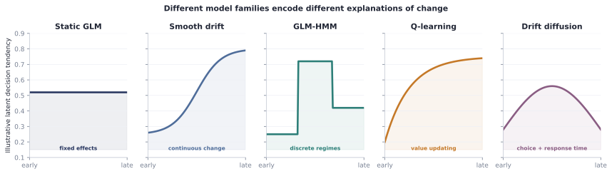

# Methods catalog

Behavio groups methods by the explanation they offer for change. Availability is not the
same as validation: consult the [capability matrix](capability-matrix.md) and each model's
recovery evidence.

If you are starting an analysis rather than browsing implementations, use the
[model-choice guide](../model-choice-guide.md) first. The [model cards](../model-cards.md)
then state each family's required observations, prediction semantics, evidence, and
unsupported uses in a common format.

<figure class="doc-figure doc-figure--wide" data-figure-kind="Conceptual">
  
  <figcaption><strong>Model-family atlas.</strong> Each family encodes a different explanation of behavioural change. The curves are conceptual signatures, not fitted data or evidence that any family is correct.</figcaption>
</figure>

## Fixed threshold, sensitivity, and bias

`PsychometricFunction` estimates a threshold and a width in stimulus units under a declared
link, with a guess and a lapse rate as separate bounded parameters. See
[psychometric functions](../psychometric-functions.md).

The signal detection family separates sensitivity from response bias for yes/no,
forced-choice, rating, and response-with-confidence data, and states every convention it
uses rather than leaving it to the reader. See
[signal detection theory](../signal-detection.md).

Neither family represents change. Both describe a fixed observer over the trials they are
given, which is what makes them the comparators a longitudinal claim has to beat; neither
has a hierarchical or smooth variant, so a multi-animal fit pools completely.

## Stable choice structure

The Bernoulli history GLM estimates stimulus and choice-history effects that remain fixed
through the study. Hierarchical variants share information across animals without treating
trials as independent subjects.

The multinomial logit extends the same stable conditional-choice role to more than two
actions, trial-specific choice sets, and an explicit modeled omission category. See
[multinomial and omission-aware choice](../multinomial.md).

## Smooth longitudinal change

Fixed-knot GLMs and drift-diffusion models allow declared parameters to vary over an
explicit clock. Hierarchical smooth models separate a population trajectory from shrunken
individual deviations.

## Discrete latent regimes

The GLM-HMM represents switching among discrete emission states. Filtered prediction is
kept separate from smoothed description, and latent-state labels are aligned only through
permutation-invariant recovery.

## Reward-driven learning

The binary Q-learning agent represents trial-by-trial value updating. It competes under the
same pointwise predictive contract as the GLM and GLM-HMM families.

## Choice and response time

Wiener drift-diffusion models jointly score choice and response time. Static, smooth,
hierarchical, and explicit-contaminant variants share physical-unit and fit-audit
contracts.

## Comparison is part of the method

A model family becomes interpretable only after specifying its alternatives, prospective
target, aggregation unit, fit diagnostics, and design-specific recovery. See
[model comparison](../comparison.md) and [model recovery](../model-recovery.md).
