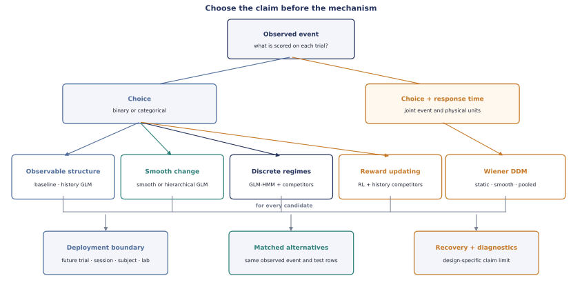

# Choose a model by the claim

Do not begin with “Should I fit an RL model or a GLM-HMM?” Begin with the event you need to
predict, the future in which it must work, and the scientific contrast that could make its
mechanism informative. Model choice comes after those commitments.

<figure class="doc-figure doc-figure--wide" data-figure-kind="Conceptual">
  
  <figcaption><strong>Decision order.</strong> A mechanism earns interpretation only after
  the observed event, deployment boundary, alternatives, and recovery design are fixed.</figcaption>
</figure>

## 1. Declare the observed event

| What is observed and scientifically relevant? | Start with | Do not compare directly with |
| --- | --- | --- |
| Binary choice | Binary baselines or Bernoulli history GLM | Joint choice/RT likelihoods |
| More than two actions or modeled omissions | `MultinomialLogit` | Binary models after silently dropping categories |
| Binary choice and response time | `WienerDriftDiffusion` family | Choice-only log scores |
| A neural measurement | A companion neural model outside Unspool | A behavioural likelihood relabelled as neural evidence |

The `scored_columns` contract enforces this boundary. A probability for choice and a joint
density for choice and response time are not commensurable scores.

## 2. Declare where prediction must generalize

Choose the splitter before inspecting candidate performance.

| Intended use | Validation geometry | Meaning of success |
| --- | --- | --- |
| Later trials in the same session | Within-session rolling origin | Filtered near-future prediction after replaying the observed prefix |
| Later complete sessions for represented animals | Forward-session splits | Forecasting the same animals later in training |
| A new animal | Leave-subject-out | Population-level transfer without fitted subject effects |
| A new laboratory | Leave-lab-out | Transfer beyond complete labs in the observed sample |
| A historical deployment sequence | Historical-cohort splits | Performance for later-arriving cohorts under the declared order |

Whole-session leave-one-out is interpolation, not forecasting. A held-out lab does not by
itself imply a population-of-laboratories estimand.

## 3. Name the simplest live explanation

### Observable choice structure

Use `BiasOnly`, `Psychometric`, `Perseveration`, `WinStayLoseShift`, or
`LapsePsychometric` when the question can be expressed as a canonical behavioural summary.
Use `BernoulliHistoryGLM` when several declared covariates and reset-safe histories must be
estimated together. These models are scientific controls, not disposable preliminaries.

### Smooth change across learning

Use `SmoothBernoulliHistoryGLM` when a coefficient is expected to vary continuously over a
declared clock. Use `HierarchicalSmoothBernoulliHistoryGLM` when individual paths should
deviate from a shared population path. Knots and clocks must be defined without future
outcomes; more flexible smoothness belongs inside nested training-only selection.

### Discrete latent regimes

Use `BernoulliGLMHMM` when switching among a small number of recurring choice policies is
the claim. Always include observable-history and smooth-change competitors. Select state
count inside training data, align labels for recovery, inspect occupancy, and use filtered
state probabilities for prospective claims.

### Reward-driven updating

Use `BinaryQLearning` for the compact reference agent or `BinaryRLAgent` for explicit
learning, forgetting, choice-kernel, policy, and reset components. A fitted learning rate
is not evidence for reward learning unless the actual reward schedule distinguishes the
agent from history, bias, lapse, and drift accounts under model recovery.

### Choice and decision time

Use `WienerDriftDiffusion` when accuracy and response time form one joint claim. The smooth
and hierarchical variants describe across-trial parameter paths; they do not change the
within-decision diffusion process into a learning model. Response-time origin, eligibility,
units, and contaminant support are part of the task contract.

### More than two actions or explicit omissions

Use `MultinomialLogit` when the stable categorical choice set is itself the target. It can
respect trial-specific availability and retain omissions as a modeled category. The
current RL, GLM-HMM, and DDM reference families are binary; do not coerce a richer task
into them merely for API convenience.

## 4. Decide whether pooling is part of the claim

| Scientific unit | Suitable starting point | Prediction for unseen subjects |
| --- | --- | --- |
| One subject | Non-hierarchical model | Not applicable |
| Population-average effect | Hierarchical static or smooth GLM | Population plug-in, explicitly labelled |
| Individual trajectories | Hierarchical smooth GLM or DDM | Evaluate represented and unseen subjects separately |
| Stable individual measure | Paired occasion estimates plus reliability analysis | Not a substitute for a joint trial-level reliability model |

Independent per-subject fits can be useful descriptive objects, but they neither pool weak
animals nor propagate estimation error into a population analysis. Conversely, a pooled
group effect does not establish reliable individual differences.

## 5. Build the candidate set around confusions

A useful candidate set contains mechanisms that can plausibly imitate one another in the
actual design:

- history GLM versus RL for reward-correlated choice repetition;
- smooth drift versus GLM-HMM for gradual versus apparently abrupt change;
- lapse versus contaminant DDM for unusual choices or response times;
- complete pooling versus partial pooling for individual variation;
- static versus smooth parameters for longitudinal change.

Candidates must score the same observed event on the same held-out rows. Hyperparameters,
state count, and smoothness are candidates too, so select them inside an inner loop.

## 6. Require the evidence stack

Before interpreting a fitted mechanism, retain:

1. source, cohort, unit, and task validation;
2. numerical fit or posterior diagnostics;
3. prospective predictions and pointwise scores;
4. calibration or posterior-predictive checks;
5. exact-design parameter recovery for reported parameters;
6. exact-design model recovery for the candidate set;
7. sensitivity to defensible preprocessing, prior, and likelihood choices; and
8. explicit failures, exclusions, and claim limits.

Passing one layer does not certify the others. A converged optimizer can estimate an
unrecoverable parameter; a recoverable model can still predict poorly; the best candidate
can still be an inadequate model of the data.

## Unsupported combinations

The current package does not yet provide a first-party multinomial RL agent, collapsing-
bound or race/LBA likelihood, hierarchical GLM-HMM, session-varying GLM-HMM transitions,
or joint trial-level Bayesian reliability model. Use a conforming external estimator when
one exists, and preserve these same task, scoring, prediction, recovery, and provenance
contracts. The [capability matrix](methods/capability-matrix.md) is the authoritative
support boundary.

Next: inspect the common-format [model cards](model-cards.md), then choose a
[worked study](tutorials/index.md) with the closest observed event and deployment geometry.
