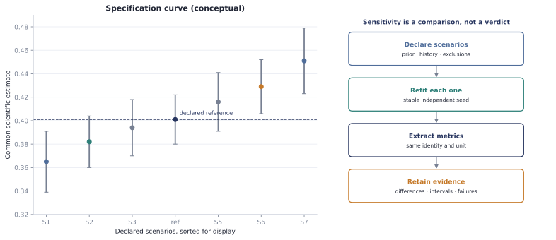

# Analysis sensitivity

A scientific conclusion can move when an analyst changes a defensible prior, history
window, omission rule, preprocessing choice, or inference backend. Unspool represents that
question as an explicit set of refits with one declared reference—not as an unrecorded
sequence of exploratory reruns.

<figure class="doc-figure" data-figure-kind="Conceptual">
  
  <figcaption>A sensitivity report keeps the full specification set. Its spread is
  descriptive evidence; Unspool does not invent a universal robustness cutoff.</figcaption>
</figure>

This contract supports a targeted prior check and a larger multiverse with the same small
API. The scientist remains responsible for explaining why each scenario is plausible.
Adding every technically possible fork can obscure that judgement as easily as reporting
only the preferred result.

## Declare, apply, and refit

`SensitivityScenario` stores a stable identity and the choices changed from the reference.
The `changes` mapping is provenance, not executable configuration: the callback must apply
those choices to the real model or pipeline.

```python
from unspool import (
    SensitivityScenario,
    audit_posterior,
    posterior_sensitivity_outcome,
    run_sensitivity_analysis,
)

scenarios = (
    SensitivityScenario(
        "reference",
        "history-glm[prior-scale=1;history=5]",
        {},
        is_reference=True,
    ),
    SensitivityScenario(
        "wider prior",
        "history-glm[prior-scale=2;history=5]",
        {"prior_scale": 2.0},
    ),
    SensitivityScenario(
        "short history",
        "history-glm[prior-scale=1;history=2]",
        {"history_lags": 2},
    ),
)


def analyse(scenario, seed):
    settings = {"prior_scale": 1.0, "history_lags": 5}
    settings.update(scenario.changes)
    posterior = fit_declared_history_model(settings, seed=seed)  # your backend
    audit = audit_posterior(posterior)
    return posterior_sensitivity_outcome(
        posterior,
        variable_names=("population_coefficient",),
        diagnostic_codes=audit.issue_codes,
    )


report = run_sensitivity_analysis(
    scenarios,
    analyse,
    seed=712,
    analysis_signature="history-glm-prior-and-memory-sensitivity[v1]",
)
```

The callback boundary keeps Unspool composable with PyMC, Stan, NumPyro, or an external
workflow. It does not require those backends in core. A scenario seed is derived from the
root seed and scenario signature, so inserting or reordering another scenario does not
change existing refits.

`posterior_sensitivity_outcome()` turns each requested natural posterior parameter into
labelled scalar means and central intervals. Subject, coefficient, state, or other named
coordinates remain in targets such as
`population_coefficient[coefficient='choice_lag_1']`. The outcome also retains model,
backend, parameter-space, artifact, and diagnostic provenance.

## Compare any common scientific metric

Sensitivity is not limited to posterior means. A callback can return an explicit
`SensitivityOutcome` containing one or more `SensitivityMetric` records:

```python
from unspool import SensitivityMetric, SensitivityOutcome

return SensitivityOutcome(
    artifact_signature=evidence_bundle.fingerprint,
    metrics=(
        SensitivityMetric(
            name="future-session log loss",
            signature="future-log-loss[v1;unit=subject;interval=subject-bootstrap]",
            estimate=mean_log_loss,
            interval=(lower, upper),
            unit="nats/trial",
        ),
    ),
    diagnostic_codes=fit.audit().issue_codes,
    provenance={"fold": "session-5-to-6"},
)
```

Every successful scenario must return the same ordered metric identities and units. This
prevents a future-session score, training likelihood, pooled-trial estimate, and
subject-balanced estimate from entering one attractive but incoherent curve. The metric
signature should encode the interval and aggregation semantics; Unspool retains intervals
but does not assume that every interval is a posterior credible interval.

## Inspect the complete report

```python
print(report.n_successful, report.n_failed)

for contrast in report.contrasts:
    print(contrast.scenario_name, contrast.target, contrast.difference)

for summary in report.summary():
    print(summary.target, summary.minimum, summary.maximum)
```

`SensitivityContrast.difference` is always alternative minus reference in the metric's
natural unit. `SensitivitySummary` reports the minimum, maximum, range, and largest
absolute reference difference across successful scenarios. It deliberately makes no
automatic “robust” decision: a meaningful change in learning rate and a meaningful change
in future log loss need domain-specific tolerances declared by the study.

An exception becomes a `SensitivityFailure` at the analysis stage. Returning different
metrics becomes an evaluation-stage failure. A failed reference makes the report
uninterpretable and yields no fabricated contrasts, while all alternative outcomes and
the reference failure remain available. Numerical warning codes are retained rather than
using convergence to select which specifications appear in the display.

`report.to_dict()` produces a JSON-safe record of scenarios, seeds, settings, outcomes,
diagnostics, failures, contrasts, and summaries.

## Exact refits and efficient diagnostics

Unspool's first sensitivity path compares explicit refits. That is boring but general: it
works for changed priors, likelihoods, preprocessing, task definitions, and backends, and
it exposes failures caused by the changed specification.

[Kallioinen et al. (2024)](https://doi.org/10.1007/s11222-023-10366-5) instead use
importance sampling under power-scaled priors or likelihoods to diagnose sensitivity and
prior–data conflict efficiently. Such estimates can be represented as common sensitivity
metrics, but Unspool does not currently implement their weighting algorithm or relabel an
approximation as an exact refit. [Schad, Betancourt, and Vasishth
(2021)](https://doi.org/10.1037/met0000275) place model sensitivity alongside prior
predictive checks, computational validation, and posterior-predictive checks in a Bayesian
cognitive-science workflow.

## Interpretation boundary

Sensitivity asks whether a reported quantity changes across declared plausible analyses.
It does not establish that:

- the reference specification is scientifically correct;
- the scenario set exhausts the garden of forking paths;
- a stable parameter is recoverable in the intended design;
- a stable fitted model predicts later sessions; or
- the same individual would receive the same estimate on another occasion.

Use prior predictive checks to evaluate prior implications, SBC to test computational
faithfulness, recovery to test design identifiability, prospective validation to test
deployment, and test–retest analysis to quantify temporal agreement. Those questions stay
separate even when one figure eventually juxtaposes their evidence.
