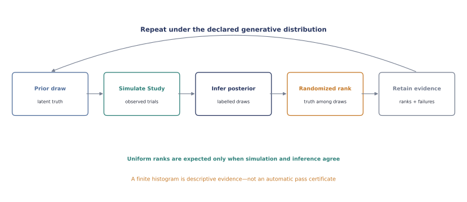

# Simulation-based calibration

Simulation-based calibration (SBC) asks whether an inference implementation recovers the
distribution that generated its inputs. Repeatedly draw parameters from the declared
prior, simulate one complete `Study`, run the same posterior inference users will run, and
rank each simulated truth among the retained posterior draws.

<figure markdown="span">
  
  <figcaption>A prior-SBC repetition tests the joint simulator–inference pipeline. The
  finite rank histogram is evidence to inspect, not an automatic certificate.</figcaption>
</figure>

This implements the rank formulation introduced by
[Talts et al.](https://arxiv.org/abs/1804.06788). The runner is backend-neutral: simulation
returns Unspool's canonical `Study`, inference returns its labelled `PosteriorResult`, and
declared test quantities connect latent truth to posterior variables.

## The workflow

The public boundary has three explicit pieces:

1. `simulator(seed)` draws from the prior predictive distribution and returns an
   `SBCSimulation(study, truth)`;
2. `inference(study, seed)` fits that simulated study and returns a `PosteriorResult`; and
3. each `SBCTestQuantity` declares which truth and posterior quantity are ranked.

For a conjugate beta–binomial check, the complete pattern is:

```python
import numpy as np

from unspool import (
    PosteriorGroup,
    PosteriorParameterQuantity,
    PosteriorResult,
    PosteriorVariable,
    SBCSimulation,
    Study,
    run_simulation_based_calibration,
)


def simulate(seed: int) -> SBCSimulation:
    rng = np.random.default_rng(seed)
    probability = rng.uniform()
    n_trials = 20
    study = Study(
        {
            "subject": ["mouse"] * n_trials,
            "session": ["session"] * n_trials,
            "trial": np.arange(n_trials),
            "session_order": np.zeros(n_trials, dtype=int),
            "choice": rng.binomial(1, probability, size=n_trials),
        }
    )
    return SBCSimulation(study, {"probability": probability})


def infer(study: Study, seed: int) -> PosteriorResult:
    rng = np.random.default_rng(seed)
    successes = int(np.sum(study["choice"]))
    failures = len(study) - successes
    values = rng.beta(1 + successes, 1 + failures, size=(2, 1_000))
    probability = PosteriorVariable(
        "probability",
        values,
        ("chain", "draw"),
        {"chain": [0, 1], "draw": np.arange(1_000)},
    )
    return PosteriorResult(
        model_name="beta-binomial",
        model_signature="beta-binomial[uniform-prior]",
        inference_library="numpy",
        inference_library_version=np.__version__,
        parameter_names=("probability",),
        groups=(PosteriorGroup("posterior", (probability,)),),
    )


report = run_simulation_based_calibration(
    simulate,
    infer,
    (PosteriorParameterQuantity("probability"),),
    repeats=500,
    seed=419,
    simulation_signature="beta-binomial-prior-predictive[v1]",
    inference_signature="beta-binomial-conjugate[v1]",
)
```

Simulation, inference, and tie-breaking receive deterministic but separate seeds. Their
human-readable signatures are retained in the report so a rank histogram cannot become
detached from the exact pipeline it evaluated.

## Inspect ranks, coverage, and failures

Each `SBCRank` retains the replicate, labelled target, simulated truth, randomized rank,
posterior draw count, posterior mean and standard deviation, central interval, and coverage
indicator. Vector parameters preserve their named posterior coordinates, for example
`bias[subject='mouse-a']`.

```python
summary = report.summary(bins=10)[0]
print(summary.mean_normalized_rank)
print(summary.interval_coverage)
print(summary.histogram_counts)
print(report.n_successful, report.n_failed)
```

The raw rank is an integer from zero through $M$, inclusive, for $M$ retained posterior
draws. Exact ties are broken uniformly at random across all admissible ranks; this avoids
systematic distortion for discrete or numerically rounded quantities. `normalized_rank`
places that discrete result at the midpoint of its unit-interval cell.

The summaries are deliberately descriptive. Unspool does not turn a finite histogram or
coverage proportion into a universal pass/fail threshold. Autocorrelated posterior draws
can themselves create non-uniform rank histograms; the
[Stan SBC guide](https://mc-stan.org/docs/stan-users-guide/simulation-based-calibration.html)
therefore recommends approximately independent draws. `thin=` makes an explicit stride
part of report provenance, but it is not a substitute for adequate effective sample size.

Simulation, inference, and evaluation exceptions become immutable `SBCFailure` records.
They count against `success_rate`; they are never silently dropped or replaced by ranks.
Use `report.to_dict()` for JSON-safe archival of every rank, failure, and summary.

## Choose test quantities deliberately

`PosteriorParameterQuantity("learning_rate")` is the natural default when simulation truth
and posterior variable share a name. A custom `SBCTestQuantity` can instead check a derived
quantity, prediction, or transformation. It must provide a stable `name` and `signature`,
return its simulated truth, and return one labelled posterior variable whose first axes are
`chain` and `draw`.

This choice is scientifically consequential. As
[Modrák et al.](https://arxiv.org/abs/2211.02383) show, SBC's ability to expose a bug depends
on the test quantities. Checking only population means can miss an error in individual
effects; checking only natural parameters can miss a faulty derived prediction. Declare
quantities that exercise the inferential claims the model will support.

## What SBC does—and does not—establish

| Question | Appropriate evidence |
| --- | --- |
| Does posterior inference reproduce the declared generative distribution? | Prior SBC |
| Can a fixed, realistic experimental design estimate a parameter? | Exact-design parameter recovery |
| Can the design distinguish candidate explanations? | Model recovery |
| Does the fitted model reproduce behaviourally meaningful summaries? | Posterior-predictive checks |
| Does it predict later sessions or new animals? | Prospective validation |
| Are conclusions stable to plausible priors and analysis choices? | Sensitivity analysis |

Good prior SBC validates the joint implementation under its own prior predictive
distribution. It does not show that the prior is scientifically plausible, the model fits
real animals, parameters are recoverable in the intended design, or conclusions transport
to future sessions. Those are separate Unspool evidence objects rather than conclusions
inferred from a single diagnostic.

The current PyMC hierarchical history-GLM adapter intentionally cannot be presented as an
end-to-end prior-SBC example: its intercept has flat prior semantics, so it does not define
a proper joint distribution from which SBC repetitions can be drawn. Unspool will not
invent a simulation prior merely to produce a reassuring histogram. A future explicitly
proper-prior model can plug into this runner without changing the SBC result contract.
