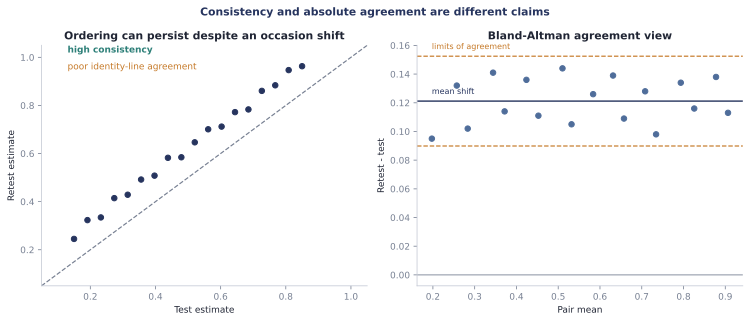

# Test-retest reliability

Test-retest reliability asks whether the same individual-level quantity is reproduced on
two genuinely comparable occasions. It is not one number. Stable ordering across animals,
linear consistency, absolute agreement, systematic occasion shift, and within-animal error
are different properties.

<figure class="doc-figure" data-figure-kind="Conceptual">
  
  <figcaption>High correlation can coexist with poor absolute agreement. A reliability
  report should show both the paired estimates and their differences.</figcaption>
</figure>

This distinction matters especially for computational phenotyping. A population effect can
replicate while the ordering of individual learning rates does not; conversely, a stable
ordering can survive a large occasion-wide shift that prevents interchangeable use of the
measurements.

## Start from exactly paired estimates

`SubjectEstimates` makes the pairing contract explicit. It requires one finite scalar per
unique subject, a target signature and unit, an occasion name, and the artifact that
produced the values.

```python
from behavio import assess_test_retest_reliability
from behavio.posterior import ReliabilityPolicy, ReliabilityStatistic, SubjectEstimates

test = SubjectEstimates(
    occasion="week-1",
    target="learning_rate",
    target_signature="q-learning-rate[v1]",
    unit="probability",
    subjects=("mouse-a", "mouse-b", "mouse-c", "mouse-d"),
    values=(0.21, 0.48, 0.35, 0.62),
    artifact_signature="fit-bundle:week-1",
)

retest = SubjectEstimates(
    occasion="week-3",
    target="learning_rate",
    target_signature="q-learning-rate[v1]",
    unit="probability",
    subjects=("mouse-d", "mouse-c", "mouse-b", "mouse-a"),
    values=(0.58, 0.39, 0.44, 0.25),
    artifact_signature="fit-bundle:week-3",
)

report = assess_test_retest_reliability(
    test,
    retest,
    seed=902,
    analysis_signature="q-learning-test-retest[v1]",
    policy=ReliabilityPolicy(
        bootstrap_repeats=2_000,
        interval_probability=0.95,
        minimum_subjects_warning=30,
    ),
)

print(report[ReliabilityStatistic.ICC_ABSOLUTE_AGREEMENT].estimate)
print(report.issue_codes)
```

Subject order may differ because alignment uses explicit labels. The subject sets must be
identical: Behavio rejects missing animals instead of silently performing complete-case
selection. If exclusions are scientifically justified, construct and report that cohort
before this function, including fit failures in the denominator elsewhere.

Differences are always **second minus first**. The raw aligned values, pair means, and
differences remain available for tables and Bland-Altman figures.

## Statistics and claims

| Statistic | Question |
| --- | --- |
| Pearson $r$ | Is the cross-subject relation approximately linear? |
| Spearman $\rho$ | Is subject ordering preserved, including tied average ranks? |
| ICC(C,1) | Are single measurements consistent after allowing an occasion mean shift? |
| ICC(A,1) | Do single measurements agree absolutely, including occasion shift? |
| Mean difference | Is there a systematic second-minus-first shift? |
| Difference SD and within-subject SD | How dispersed are within-subject changes? |
| Lower and upper limits of agreement | What range contains ordinary pair differences under the declared multiplier? |
| MAE and RMSE | How large are absolute errors in the target's natural unit? |

The ICCs use the two-way, single-measure ANOVA formulas commonly denoted ICC(C,1) and
ICC(A,1). Behavio reports the formula names rather than ambiguous labels such as “the ICC.”
It does not assign universal poor/moderate/good categories.

The default limits of agreement are mean difference $\pm 1.96$ difference SD. The
multiplier is explicit in `ReliabilityPolicy`; changing it changes the estimand and remains
in report provenance.

## Paired-bootstrap uncertainty

Each bootstrap repetition resamples whole subjects and carries both occasions together.
Percentile intervals therefore preserve pairing. The report retains every finite bootstrap
statistic and the number of invalid repetitions separately for each measure.

Small samples or resamples containing only one unique value can make correlations or ICCs
undefined. Behavio stores `None`, emits `reliability.undefined` or
`reliability.bootstrap-effective`, and never coerces an undefined value to zero. The
minimum effective-bootstrap fraction and a transparent small-sample warning threshold are
policy, not claims that a particular sample size guarantees precision.

Set `bootstrap_repeats=0` for an explicitly point-estimate-only report. No interval is then
fabricated. `report.to_dict()` includes raw bootstrap values by default;
`include_bootstrap=False` makes a compact display record without changing the report.

## From labelled posterior results

For a posterior variable with one `subject` dimension, extract per-subject posterior means
without losing model and backend provenance:

```python
from behavio.posterior import posterior_subject_estimates

week_1 = posterior_subject_estimates(
    posterior_week_1,
    "coefficient",
    occasion="week-1",
    coordinate={"term": "reward_lag_1"},
)
week_3 = posterior_subject_estimates(
    posterior_week_3,
    "coefficient",
    occasion="week-3",
    coordinate={"term": "reward_lag_1"},
)

report = assess_test_retest_reliability(
    week_1,
    week_3,
    seed=902,
    analysis_signature="reward-history-coefficient-reliability[v1]",
)
```

Every non-subject posterior dimension must be selected explicitly. This prevents averaging
over coefficients, states, or conditions merely to obtain one convenient value per animal.

`posterior_subject_estimates` also retains the full `(sample, subject)` draw matrix and the
result's convergence audit. `values` is still the per-subject posterior mean, unchanged, but
because the draws travel with it `assess_test_retest_reliability` no longer treats those
means as observed data. Each repetition resamples subjects *and* takes one independently
sampled posterior draw from each occasion, so the interval covers sampling and posterior
uncertainty together and the reported statistic is the posterior mean of the per-draw
statistic. Draw indices are sampled independently for the two occasions: they come from
separate fits, their draws are not jointly distributed, and pairing them by index would
fabricate a coupling. `report.to_dict()["uncertainty_sources"]` records which sources were
propagated.

A failing convergence audit does not raise. It is retained on the estimates and surfaces as
`reliability.unconverged-posterior` in the report, so the layer above decides whether to
publish. Inject a `PosteriorAuditPolicy` through `audit_policy=` to declare, check by
check, which severities you are downgrading.

### Shrinkage

Per-subject estimates from a partial-pooling model are shrunk toward a common mean.
Correlating two sets of shrunken estimates inflates Pearson, Spearman, and both ICCs,
because the shared prior pulls both occasions toward the same point and that reads as
agreement. Pooling is a fact about the model rather than about the numbers, so it is
declared: `posterior_subject_estimates` defaults to `SubjectPooling.PARTIAL`, the
conservative side, and hand-built `SubjectEstimates` default to `SubjectPooling.NONE`.
Pass `pooling=SubjectPooling.NONE` for independently fitted subjects.

When either occasion is pooled the report carries `reliability.shrunken-estimates`. That is
a warning, not a correction: undoing shrinkage needs the hierarchical variance components,
which a `SubjectEstimates` record does not carry. Treat a flagged consistency or agreement
estimate as an upper bound.

## Interpretation boundary

Comparable occasions are essential. Early and late learning sessions are expected to
change; treating that trajectory as measurement error would answer the wrong question.
Use this contract for repeated measurements intended to index the same relatively stable
quantity under a comparable protocol, and use Behavio's trajectory and prospective tools
for learning-related change.

The estimator propagates posterior uncertainty when draws are available and falls back to a
paired subject bootstrap of plug-in estimates when they are not. It still does not model
shrinkage, and it does not estimate the reliability of a latent quantity jointly across
occasions. [Chen et al. (2021)](https://doi.org/10.1016/j.neuroimage.2021.118647) show why trial-level
hierarchical reliability models can separate trial noise from cross-occasion stability;
[Schaaf et al. (2024)](https://doi.org/10.3758/s13428-023-02203-4) discuss the consequences
for reinforcement-learning parameters. A future joint model should be a separate backend
with recovery tests—not an invisible correction to these transparent plug-in statistics.

Reliability also does not establish parameter recovery, model validity, prospective
prediction, or sensitivity to analytic choices. It answers whether the declared measure
behaves consistently and agrees across these two occasions in this paired cohort.
